# 🏛️ Birzeit Municipality Archiving System (BMAS)

> A secure, intelligent, and role-based digital archiving platform designed to modernize document management for municipal organizations.

---

## 📋 Overview

The Birzeit Municipality Archiving System (BMAS) was developed to replace inefficient manual document management systems such as Excel sheets, Word documents, and paper-based records.

These traditional systems often resulted in document loss, poor classification, and time inefficiency.
BMAS provides a centralized digital solution that enables secure, efficient, and intelligent document storage and retrieval.

---

## ✨ Key Features

* 🔎 **Semantic Search** — Retrieve documents based on meaning and context using SPARQL and RDF
* 🔐 **Role-Based Access Control (RBAC)** — Structured permissions for different user roles
* 📄 **Document Archiving Workflow** — Metadata entry, validation, and approval process
* 🔄 **Version Control** — Maintain history and previous document versions
* 🏷️ **Dynamic Metadata Management** — Flexible metadata schemas per category
* 📊 **Reporting System** — Generate reports with filtering and export capabilities
* 🗂️ **Department & Category Management** — Organized hierarchical structure
* 📝 **Audit Logging** — Track all system activities
* 🔒 **Secure Authentication** — Password hashing and protected access

---

## 👩‍💻 My Contribution

* Developed backend functionality using **Flask (Python)**
* Designed and implemented **MySQL database schema**
* Built **semantic search using GraphDB, RDF, and SPARQL**
* Implemented **role-based access control system**
* Contributed to **frontend UI and user experience**

---

## 🛠️ Tech Stack

### Backend

* Python
* Flask

### Database & Storage

* MySQL
* GraphDB (RDF & SPARQL)
* Local File Storage

### Frontend

* HTML5, CSS3
* JavaScript
* Bootstrap 5

### Tools

* GitHub
* Postman
* MySQL Workbench
* GraphDB Workbench

---

## 🏗️ Architecture

The system follows a multi-layered architecture:

* Presentation Layer (User Interface)
* Business Logic Layer (Flask Backend)
* Domain Layer (RBAC & Search Logic)
* Data Layer (MySQL + GraphDB + File Storage)

---

## 📸 Screenshots

### 🔑 Authentication

| Login                           | 
| ------------------------------- |
| 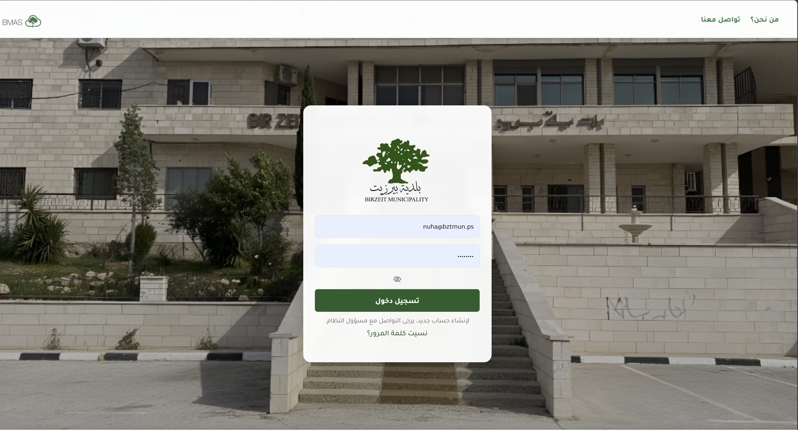 |

| create new account by the adminstrative affairs  |
|  ----------------------------------------------- |
| 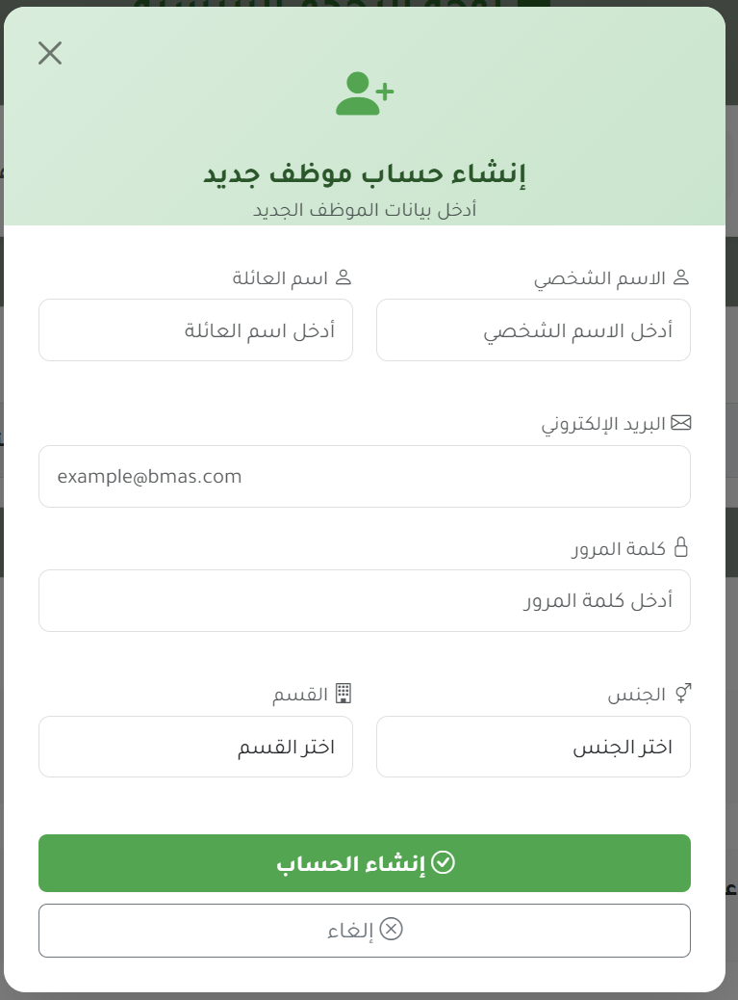 |

| Approve/Reject requests          |
| -------------------------------  |
| 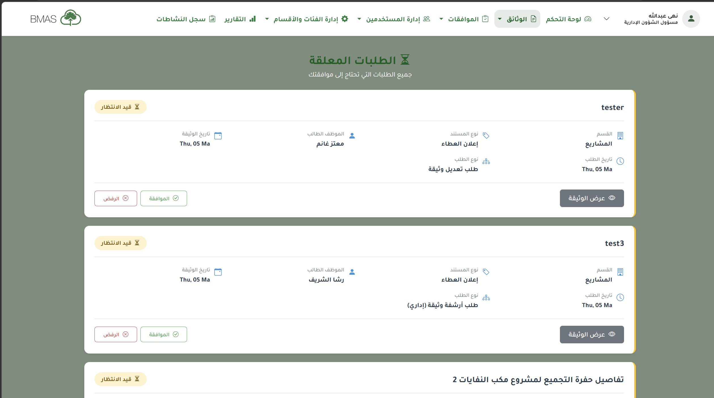  |

### 🏠 Dashboards

| Admin Dashboard                           |
| ----------------------------------------- |
| 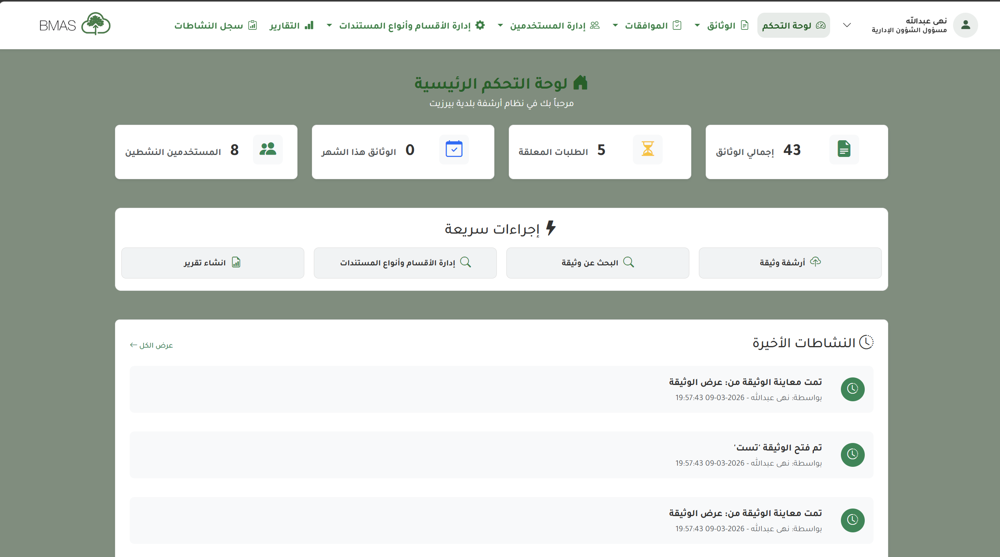 |

| RBAC                                      |
| ----------------------------------------- |
| 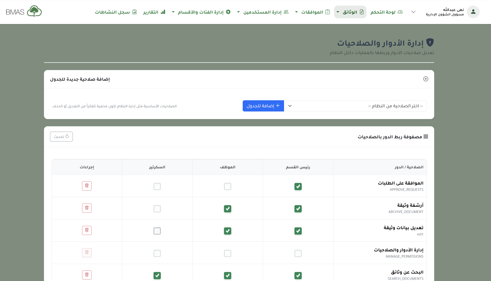       |

### 📂 Core Features

| View Documents                          |
| --------------------------------------- |
| 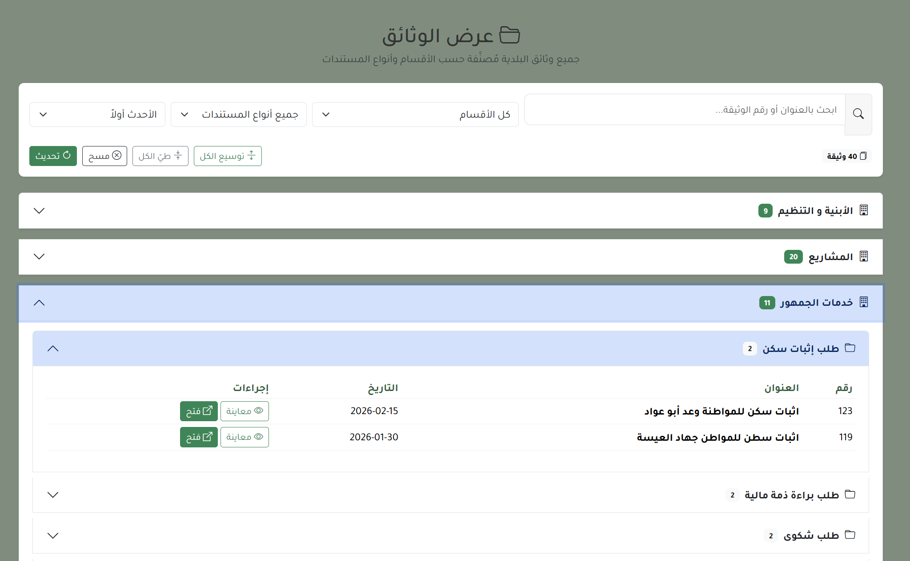 | 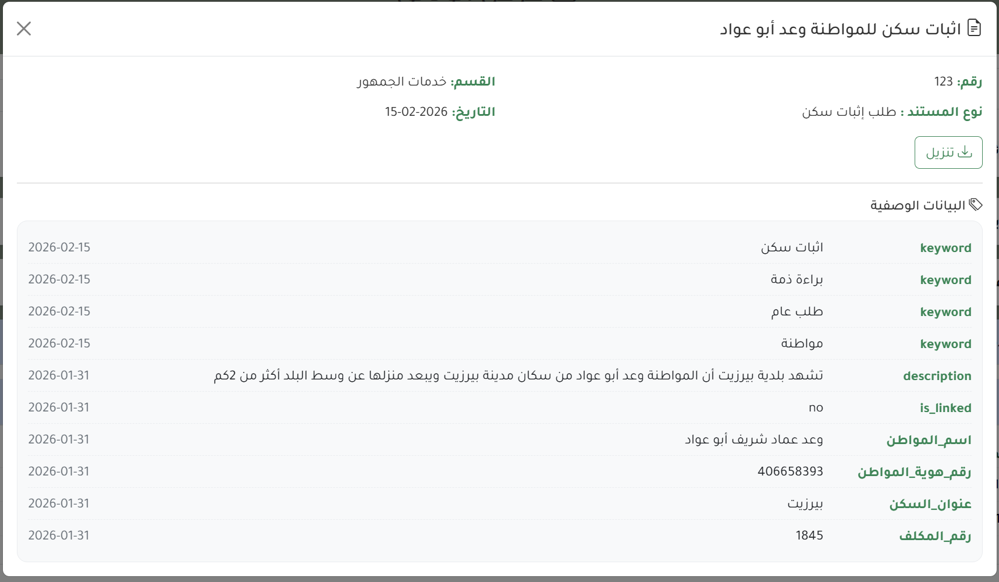 |

| Semantic Search                   |
| --------------------------------- |
| 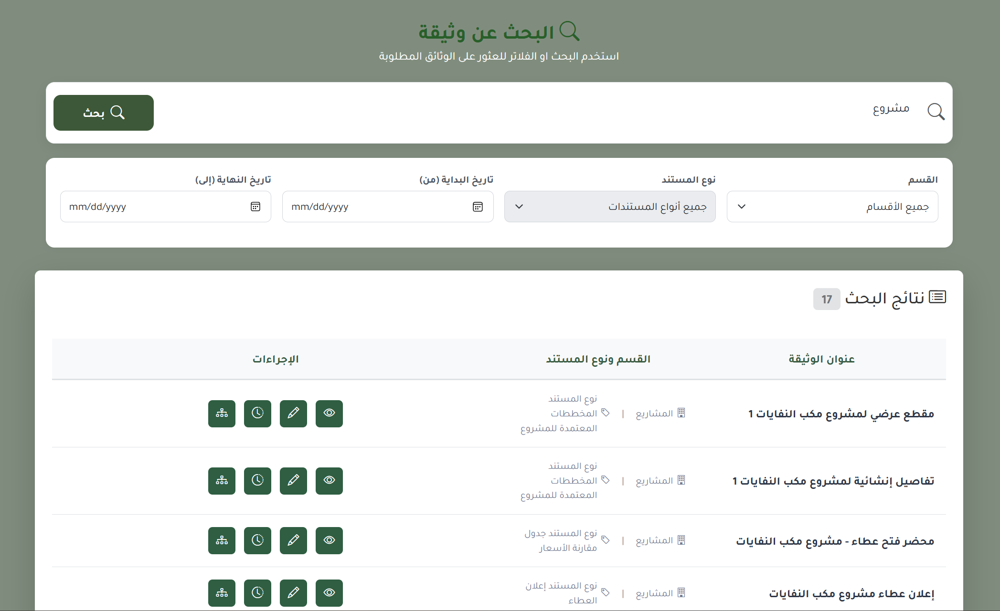 |

| Archive                             | 
| ----------------------------------- | 
| 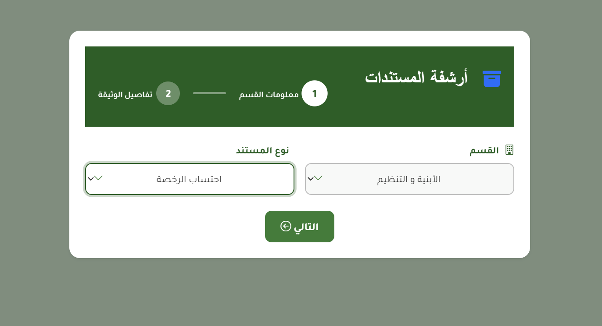 | .png) | .png) | .png) |

| metadata                          |
| --------------------------------- |
| 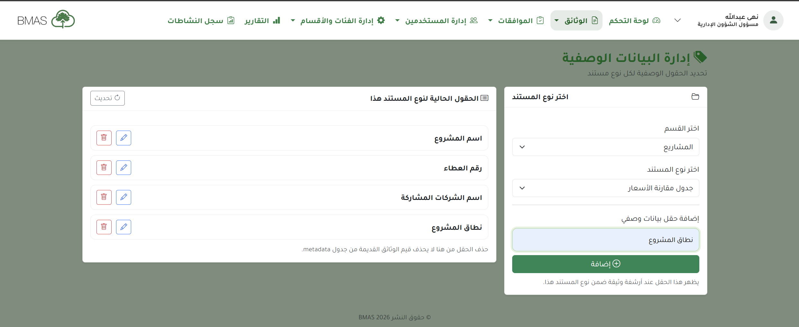 |

| Department and category management  |
| ----------------------------------- |
| 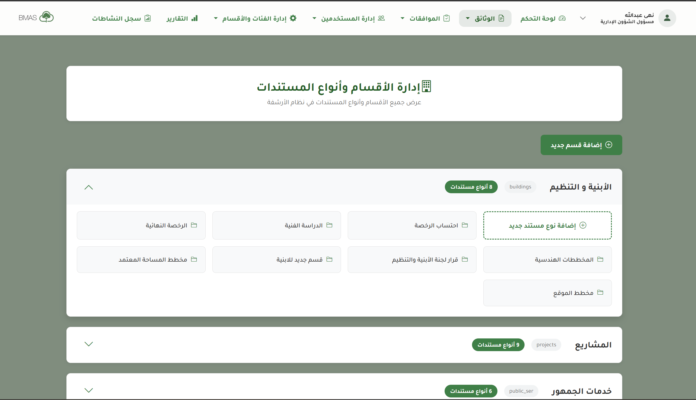 |

| Reports                             |
| ----------------------------------- |
| 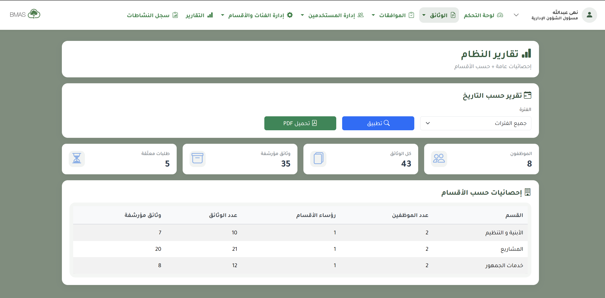 |

---

## 📚 Project Context

This project was developed as a: **Graduation Project**
Developed collaboratively as a team project.

---

## ⭐ Key Highlights

* Full-stack system design
* Real-world problem solving
* Integration of semantic technologies (RDF & SPARQL)
* Secure and scalable architecture
